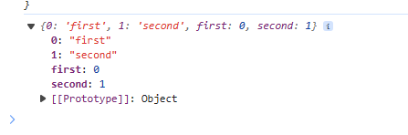

# TS 常用技巧

tsconfig.json 中启用`experimentalDecorators`选项

## 函数重载

```ts
function add(a: string, b: string): string
function add(a: number, b: number): number
function add(a: number | string, b: number | string) {
  if (typeof a === 'number' && typeof b === 'number') {
    return a + b
  }
  if (typeof a === 'string' && typeof b === 'string') {
    return a + b
  }
}
```

函数重载实际就是对函数参数的类型组合进行说明

## 枚举

```ts
enum Permission {
  read, // 0
  write, // 1
  delete, // 2
}
```

枚举默认值从 0 开始

直接打印一个枚举

```ts
enum Num {
  first,
  second,
}

console.log(Num)
```



打印结果可以看到枚举实际是一个对象，所以可以直接使用 for in 来遍历这个对象

```ts
0
1
first
second
```

## 接口

#### 使用接口来约定一个函数

```ts
interface Callback {
  (num: number[]): boolean
}
function sum(callback: Callback) {}
```

#### 接口的继承

```ts
interface A {
  a1: string
}

interface B extends A {
  a2: number
}

const a: B = {
  a1: '1',
  a2: 1,
}
```

#### 使用 type 的交叉类型也可以实现接口继承的效果

```ts
type AA = {
  a1: string
}

type BB = {
  b1: number
} & AA

const b: BB = {
  a1: '11',
  b1: 1,
}
```

#### 类型保护函数

```ts
interface IAdmin {
  pwd: string
}

function hasPwd(param: any): param is IAdmin {
  if (param.pwd) {
    return true
  }
  return false
}

const arr = [
  {
    name: '123',
    age: 123,
  },
  {
    pwd: '123',
  },
]

arr.forEach((item) => {
  if (hasPwd(item)) {
    // 此时ts能够推断出item上一定存在pwd属性
    console.log(item.pwd)
  } else {
    console.log(item.name)
  }
})
```

## readonly

```ts
const arr: ReadonlyArray<number> = [1, 2]
```

## 使用模块化

|      配置名称       |               含义               |
| :-----------------: | :------------------------------: |
|       module        |  设置编辑结果中使用的模块化标准  |
|  moduleResolution   |        设置解析模块的模式        |
| noImplicitUseStrict |   编辑结果中不包含“use strict”   |
|   removeComments    |        编译结果中移除注释        |
|    noEmitOnError    |         错误时不生成结果         |
|   esModuleInterop   | 启用 es 模块化交互非 es 模块导出 |

## 抽象类

抽象类一般用于定义一个功能概念，不能 new 具体的实例

```ts
abstract class Chess {
  x: number = 0
  y: number = 0

  // 抽象类并不知道name该赋值什么，所以需要交给子类实现，子类必须实现
  abstract readonly name: string
}

class Pao extends Chess {
  name: string = 'pao'
}
```

子类中相同的判断都可以在父类中通过抽象方法来实现，抽象方法中将具体执行的步骤写好，子类只需要实现各个步骤的返回结果

## 单例模式

```ts
class Board {
  private static _board?: Board

  private constructor() {}

  static create(): Board {
    if (this._board) {
      return this._board
    } else {
      this._board = new Board()
      return this._board
    }
  }
}
```

## 索引器

在 ts 中，默认情况下，不对成员表达式进行检查，需要开启`noImplicitAny`，开启对隐式 any 的检查

```ts
interface IUser {
  name: string
}

const user: IUser = {
  name: '123',
}

user['age']
```

使用索引器避免这种问题

```ts
class User {
  // 索引器在类中需要写在最顶端
  [prop: string]: any

  constructor(public name: string, public age: number) {}
}

const user = new User('123', 12)

user['prop']
```

```ts
class MyArray {
  [index: number]: string

  0 = '1'
}

const myArr = new MyArray()

myArr[4]
```

## `this`指向约束

开启`noImplicitThis`选项，表示不允许 this 隐式的指向 any

```ts
interface IUser {
  age: number
  say(this: IUser): void
}

const user: IUser = {
  age: 123,
  say() {
    console.log(this.age)
  },
}

const a = user.say

a()
```

此时调用 `a` 方法会报错

## 装饰器

### 类装饰器

```ts

```
